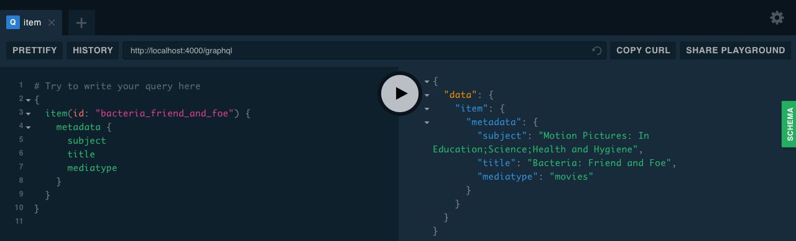
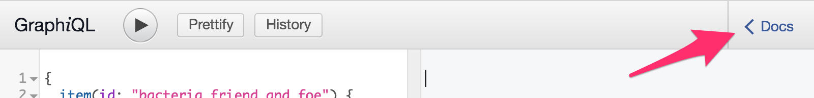

# Archive-GraphQL

GraphQL wrapper for [Archive.org](internet-archive)’s open API.



## Setup

```
npm i
npm run start
```

GraphQL endpoint is at `localhost:3000/graphql`.

GraphiQL graphical endpoint at `localhost:3000/graphiql`.

## Schema

### Item

Get an individual item by ID. To find an item’s ID, look at the URL segment
after `/details/`. For instance, for the URL
`https://archive.org/details/principleofrelat00eins`, the item ID is
`principleofrelat00eins`.

## Operations

### Query

| Name | Type     | Required |
| :--- | :------- | :------- |
| `id` | `String` | ✅        |

### Example

```
{
  item(id: "bacteria_friend_and_foe") {
    metadata {
      title,
      year,
      description,
      creator,
      language,
      country,
      type
    }
  }
}
```

### Fields



To view the data structure, clone this repo and run it locally (`npm i && npm run start'), navigate to `localhost:3000/graphiql`. Then click “Docs” in the top-right.

### Books

Coming soon!

### Search

Coming soon!

### Wayback Machine

Coming soon!

## Data Sanitization

This library takes the liberty of sanitizing some data.

### Polymorphism

- If a field can either be a string or an array of strings, it’s forced to always be an array of strings (e.g: `metadata.creator`).

### Language

The `Language` field is coerced into the [RFC 5646 spec][lang-spec] (e.g: `en`, `en-CA`, `de`, `ja`, `zh-CN`).

### Year

`Year` is sanitized into an integer, with negative numbers representing `BCE` (e.g.: `1970` for _1970 CE_, `-300` for _300 BCE_).


[internet-archive]: https://archive.org
[lang-spec]: https://tools.ietf.org/html/rfc5646
